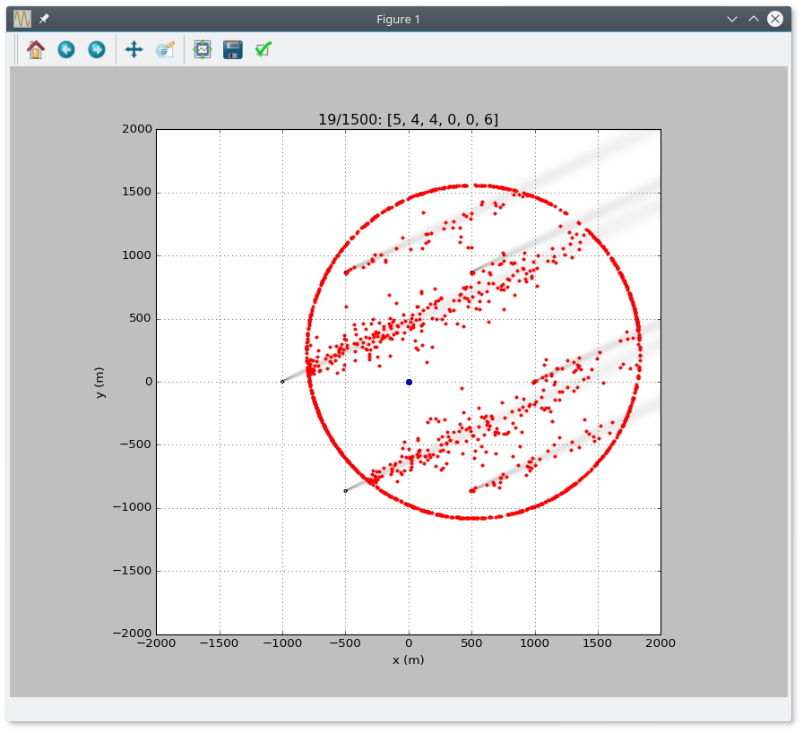
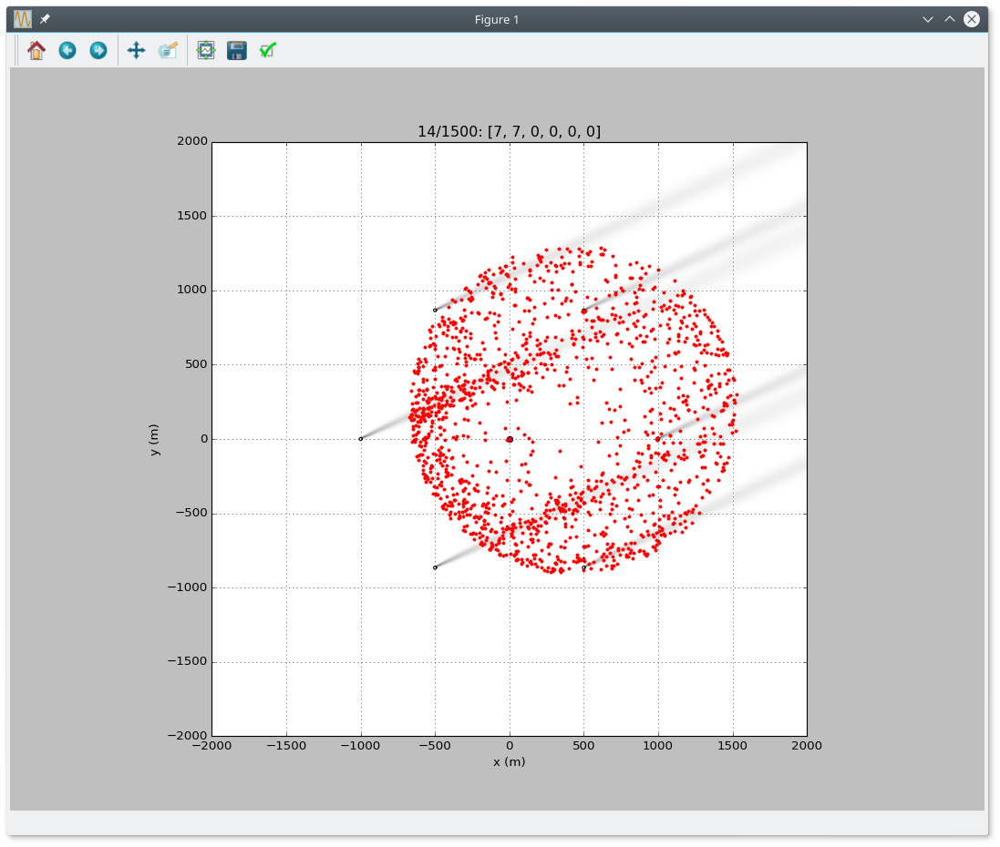

## odor_tracking_sim 

Simple simulation of fruit-fly odor tracking for Kate's desert release experiments.





## Installation

Requirements: python-numpy python-scipy python-matplotib, python-tk or python-pyqt5


```bash
$ python setup.py install 

```

or 
```bash
$ python setup.py develop
```


## Examples

See the examples sub-directroy for examples demonstrating how to run the
simulation, e.g. the run_simulation.py script.


